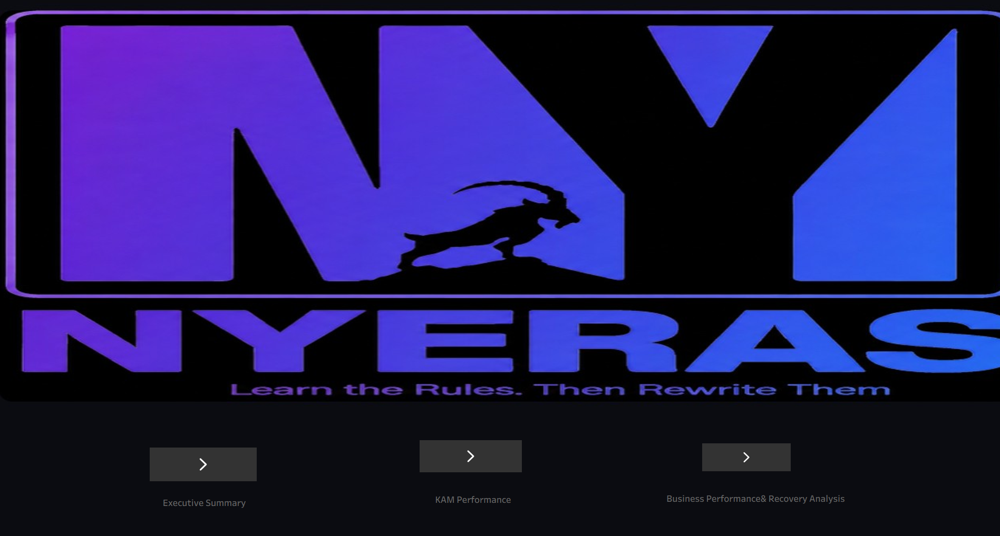
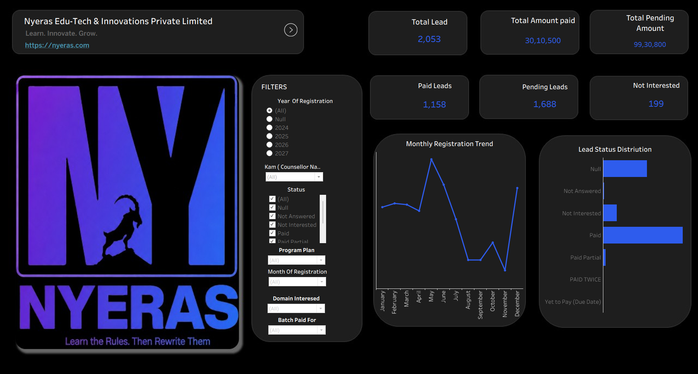

# 📊 NYERA’S Lead & Sales Analytics Dashboard

### 1. Project Title

📊 NYERA’S Lead & Sales Analytics Dashboard

An interactive business intelligence dashboard developed using Tableau to analyze lead generation, sales performance, registrations, payment status, pending amounts, and business performance.

---

### 2. Short Description

The NYERA’S Lead & Sales Analytics Dashboard is an interactive analytics solution designed to provide an overview of lead management and sales performance.

The project focuses on analyzing total leads, payments received, pending amounts, lead status, monthly registration trends, KAM performance, sales performance, and domain-wise business performance. Interactive filters help users explore lead data and identify performance patterns.

---

### 3. Tech Stack

* 📊 Tableau – Used for dashboard development, interactive reporting, and data visualization.
* 🧹 Data Analysis – Used to analyze lead and sales performance.
* 📈 Data Visualization – Used to present business trends and performance metrics.
* 🎛️ Interactive Filters – Used for dynamic analysis across business dimensions.
* 🧮 Calculated Fields – Used to derive pending amounts and support KPI calculations.

---

### 4. Data Source

The dashboard uses a lead management dataset containing information related to:

* Lead details
* Registration status
* Amount paid
* Pending amount
* Lead status
* Monthly registration trends
* KAM and counsellor performance
* Sales performance
* Domain and program details

The dataset was analyzed to develop interactive dashboards and monitor lead and sales performance.

---

### 5. Features

* 📊 Total Leads Analysis
* 💰 Total Amount Paid
* 🧾 Total Pending Amount
* ✅ Paid Leads Analysis
* ⏳ Pending Leads Analysis
* 📉 Not Interested Leads Analysis
* 📅 Monthly Registration Trends
* 👥 KAM Performance Analysis
* 💼 Sales Performance Analysis
* 📚 Domain-wise Lead Analysis
* 💰 Revenue by Domain
* 🎯 Interactive Filters and KPIs

---

### Business Problem

Managing lead generation, registrations, payments, and sales performance across multiple domains can make it difficult to monitor business progress and identify areas requiring attention.

### Goal of the Dashboard

The goal of this project is to provide an interactive view of lead and sales data using Tableau, enabling users to monitor key performance indicators, analyze KAM and sales performance, track pending payments, and evaluate domain-wise business performance.

### Key Visuals

* Total Leads
* Total Amount Paid
* Total Pending Amount
* Paid, Pending, and Not Interested Leads
* Monthly Registration Trend
* Lead Status Distribution
* KAM Performance
* Sales Performance
* Leads by Domain
* Revenue by Domain
* Pending Payment Analysis
* Interactive Filters

### Business Impact & Insights

The dashboard helps users:

* Monitor overall lead generation
* Track payment collection and pending amounts
* Understand lead status distribution
* Analyze monthly registration trends
* Compare KAM performance
* Evaluate sales performance
* Identify domains contributing to lead generation and revenue
* Monitor business performance using interactive filters
* Support data-driven decision-making

---

## 📷 Dashboard Preview — Tableau

### Home Page

### KAM Performance

### Business Performance

---

## 🛠️ Tools Used

**Tableau | Data Analysis | Data Visualization | KPI Analysis | Interactive Dashboards**
